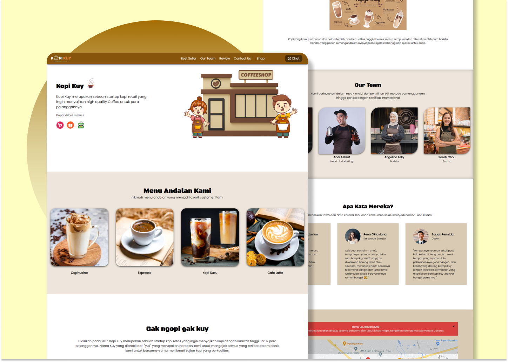
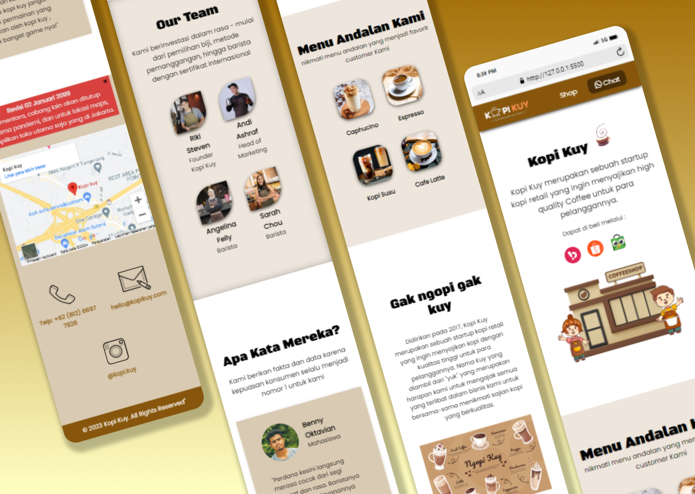
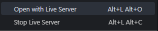
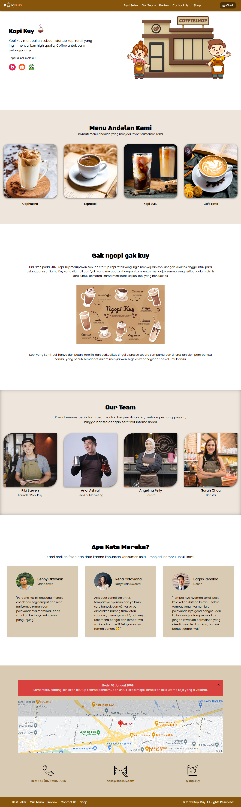
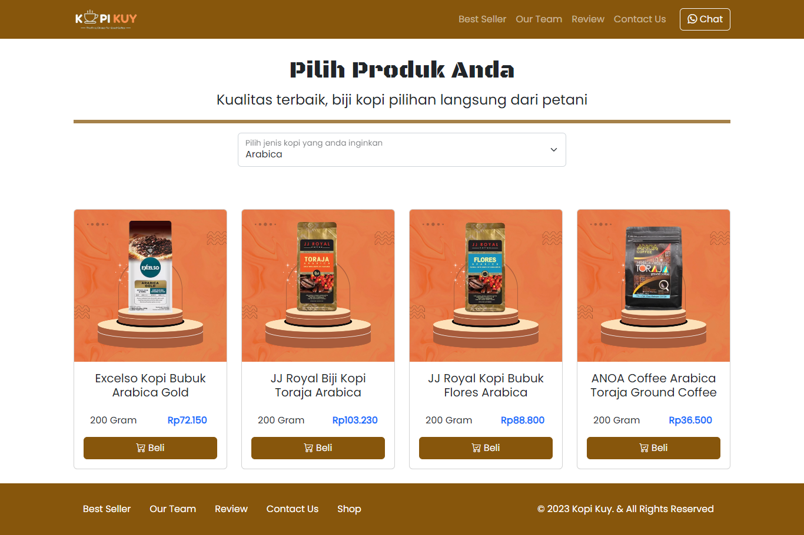

<p align="center"><a href="https://github.com/ZuyinatinK/kopi-kuy"></a></p>
<h1 align="center">Kopi Kuy ☕</h1>

Selamat datang 👋🏼 di website profil perusahaan **Kopi Kuy ☕**! Proyek ini dibangun sebagai bagian dari pelatihan saya di **Xpertrainer** dengan judul kursus "Belajar Membangun Website untuk Memulai Karir sebagai Software Developer". Website ini menampilkan profil perusahaan Kopi Kuy serta halaman toko yang menampilkan produk-produknya, yang ditampilkan secara dinamis dari file JSON.

<p align="center">
	·<a href="https://zuyinatink.github.io/kopi-kuy/">View Demo</a>·
</p>

## Daftar Isi

- [Preview](#preview)
- [Tentang Proyek](#tentang-proyek)
- [Teknologi yang Digunakan](#teknologi-yang-digunakan)
- [Struktur Proyek](#struktur-proyek)
- [Instalasi](#instalasi)
- [Penggunaan](#penggunaan)
- [Kesimpulan](#kesimpulan)

## Preview 🚀



## Tentang Proyek

Website ini merupakan profil perusahaan yang sederhana dan responsif untuk **Kopi Kuy**, sebuah brand coffee shop. Website ini terdiri dari dua halaman utama:
1. **Halaman Profil Perusahaan**: Menampilkan informasi tentang Kopi Kuy, termasuk visi, misi, dan nilai-nilai perusahaan.
2. **Halaman Toko**: Menampilkan daftar produk kopi yang dijual oleh Kopi Kuy, yang diambil secara dinamis dari file `data.json` menggunakan **JavaScript** dan **JQuery**.

Proyek ini membantu saya mendapatkan pengalaman langsung dalam pengembangan web menggunakan teknologi modern dan prinsip desain responsif.



## Teknologi yang Digunakan

- **HTML5**: Untuk struktur halaman web.
- **CSS3**: Untuk gaya dan tampilan halaman web.
- **Bootstrap 5.2.3**: Untuk desain dan tata letak responsif.
- **JavaScript**: Untuk menambahkan interaktivitas dan fungsionalitas pada website.
- **JQuery 3.6.3**: Untuk manipulasi DOM dan pemuatan data produk secara dinamis.
- **JSON**: Untuk menyimpan dan mengambil data produk di halaman toko.

## Struktur Proyek

Struktur proyek ini adalah sebagai berikut:
``` bash
kopi-kuy/
│
├── css/
│   └── style.css
├── font/
│   ├── bootstrap-icons.woff
│   ├── bootstrap-icons.woff2
│   └── poppins.woff2
├── images/
│   ├── about-us/
│   ├── background/
│   ├── customer/
│   ├── header/
│   ├── icon/
│   ├── logo/
│   ├── produk/
│   └── team/
│   └── favicon.ico
├── js/
│   └── jquery-3.6.3.main.js
├── media/ #Media yang ditampilkan untuk README.md
├── vendor/
│   └── bootstrap/
│       ├── bootstrap-icons.css
│       ├── bootstrap.bundle.min.js
│       ├── bootstrap.min.css
│       ├── cerulean.css
│       ├── litera.css
│       ├── pink.css
│       ├── quartz.css
│       ├── sketchy.css
│       ├── solar.css
│       └── vapor.css
├── data.json
├── index.html
├── produk.html
└── README.md
```


## Instalasi

Untuk menjalankan proyek ini secara lokal, ikuti langkah-langkah berikut:

1. **Kloning repositori**:
   ```bash
   git clone https://github.com/ZuyinatinK/kopi-kuy.git
    ```
2. Masuk ke direktori proyek:
    ```bash
    cd kopi-kuy
    ```
3. Buka file index.html di browser Anda untuk melihat halaman profil perusahaan:

    
    ```bash 
    http://127.0.0.1:5500/index.html
    ```
4. Buka file produk.html untuk melihat halaman produk:
    
	
    ```bash
    http://127.0.0.1:5500/produk.html
    ```

## Penggunaan

1. Halaman Profil Perusahaan menyediakan informasi tentang Kopi Kuy dan layanannya.

    

2. Halaman Shop menampilkan produk-produk yang dijual oleh Kopi Kuy, yang diambil secara dinamis dari file data.json menggunakan JavaScript dan JQuery. Anda dapat melihat berbagai produk kopi yang tersedia.

    


## Kesimpulan

Proyek Kopi Kuy adalah implementasi dari keterampilan yang saya pelajari dalam membangun website dinamis dan responsif. Menggunakan HTML5, CSS3, JavaScript, JQuery, dan Bootstrap, saya telah berhasil membuat website yang menampilkan profil perusahaan dan produk secara terstruktur dan interaktif. Melalui proyek ini, saya memperoleh pemahaman yang lebih dalam tentang pengembangan frontend dan penggunaan framework serta library untuk mendukung tampilan yang responsif. Ini adalah fondasi yang kuat bagi saya untuk melanjutkan karir sebagai Software Developer.


## Credits

This project was developed by Zuyinatin Khofifah. Special thanks to **Xpertrainer** for providing the training and guidance.
